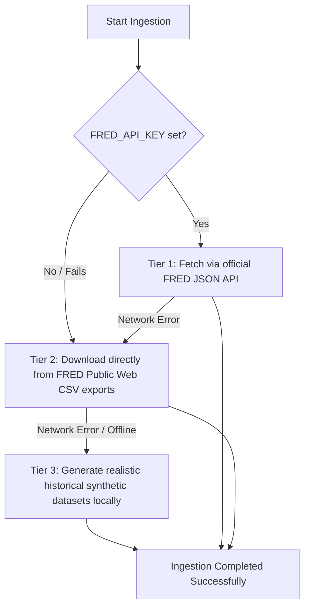

# India Macro, Risk & Policy Analytics

[](https://opensource.org/licenses/MIT)
[](https://www.python.org/)
[](https://pandas.pydata.org/)
[](https://facebook.github.io/prophet/)

An institutional-grade macroeconomic analytics, modeling, and policy risk project tailored for applications in **Asset-Liability Management (ALM)**, **Treasury Risk Management**, **Quantitative Macro Research**, and **Fixed-Income Analytics** roles.

This repository implements a robust data-ingestion pipeline, aligns distinct data frequencies using proper financial-averaging rules, performs policy transmission analysis, builds predictive models for CPI inflation (using ARIMA and Prophet with monetary policy regressors), and synthesizes an RBI-style policy stance.

---

## 📊 Executive Stance & Analytical Summary
Based on the synthesized master macro dataset (spanning 2015 to May 2026), the Indian monetary policy stance is **mildly restrictive** in real terms:
* **Positive Real Rates**: The real policy rate (Repo Rate minus CPI YoY inflation) has transitioned cleanly into positive territory, reflecting the Reserve Bank of India’s (RBI) commitment to durable disinflation.
* **Lagged Transmission**: A distinct 6-to-9 month transmission lag is evident from the cross-correlation structure. Historical hikes in the repo rate are followed by a gradual moderation of consumer prices rather than an immediate correction.
* **Controlled Economic Slowdown**: While Industrial Production (IIP) growth has softened slightly in response to tightening, the deceleration is orderly, indicating successful macroeconomic stabilization without disorderly growth contraction.
* **System Liquidity & Yields**: Active liquidity withdrawals (average net system liquidity moving from surplus to neutral/deficit) have successfully anchored the short end of the curve, while the 10Y G-Sec yield continues to price in restraint.
* **Stance Recommendation**: **"Hold Restrictive"** rather than "Easing". Given global bond yield volatility, food supply shocks, and incomplete core disinflation, premature rate cuts present a material risk of reinflating baseline prices.

---

## ⚙️ Robust Ingestion & Data Architecture
A key challenge in macroeconomic modeling is **frequency mismatch** (e.g., merging daily yields with monthly index values). This project implements clean, distinct resampling and aggregation rules to construct a statistically sound master dataset:

| Macro Variable | Frequency | Source / Ingest | Aggregation / Standardization Rule |
| :--- | :--- | :--- | :--- |
| **CPI (Consumer Price Index)** | Monthly | FRED (INDCPIALLMINMEI) | Standard End-of-Month (EOM) index matching. |
| **10Y G-Sec Yield** | Daily | FRED (INDIRLTLT01STM) | Monthly arithmetic mean to smooth short-term daily volatility. |
| **IIP (Industrial Production)** | Monthly | MOSPI (Manual CSV) | Standard monthly index matching. |
| **Unemployment Rate** | Monthly | CMIE / Labor Portal | Pre-aggregated monthly labor survey rate. |
| **Repo Rate** | Event-Based | RBI (Manual CSV) | Monthly **last** available rate (captures the policy state at EOM). |
| **System Liquidity** | Daily | RBI DBIE (Manual CSV) | Monthly arithmetic mean of net outstanding daily liquidity. |

---

## 🛡️ Enterprise-Grade Reliability & Offline Fallbacks
To ensure this repository is 100% plug-and-play for recruiters and quantitative researchers without requiring manual API configurations, the ingestion layer is built with a **three-tier redundancy architecture**:



1. **Tier 1 (Official API)**: Fetches live data from FRED's JSON observations endpoint if a local `.env` file containing `FRED_API_KEY` is present.
2. **Tier 2 (Keyless Public Scraper)**: If no key is set or the API fails, the pipeline automatically redirects to FRED's public web export CSV URLs. It downloads and reformats the data transparently with no user action required.
3. **Tier 3 (Worst-Case Synthetic Generator)**: If the system is entirely offline or FRED is blocked, an integrated mathematical generator simulates realistic, high-fidelity historical series for Indian CPI and 10Y Yields starting from 2015.

---

## 📁 Repository Directory Structure

```text
india_macro_internship_project/
├── .env.example            # Environment variables template for FRED API
├── .gitignore              # Ignores system, IDE, and virtual environment files
├── README.md               # Premium project documentation
├── requirements.txt        # Modular dependency requirements
├── RUN_THIS_FIRST.md       # Running instructions summary
│
├── data/
│   ├── cleaned/            # Intermediate monthly and master datasets (cpi, iip, macro_master, etc.)
│   └── raw/                # Ingested raw datasets (FRED downloaded & manual inputs)
│
├── src/
│   ├── __init__.py
│   └── fred_client.py      # Robust FRED client with public & synthetic fallbacks
│
├── scripts/
│   └── download_fred_data.py # CLI script to download and pre-populate macro data
│
├── notebooks/
│   └── India_Macro_Policy_Risk_Analytics.ipynb # End-to-end analytical notebook with populated outputs
│
└── outputs/
    ├── inflation_forecast.csv # Tabular model forecast comparison
    └── figures/            # Visual dashboard charts exported directly from the pipeline
```

---

## 📈 Visual Dashboard Preview
The pipeline exports high-resolution, analytical charts under `outputs/figures/` to support treasury desk reviews:
1. **`01_inflation_vs_repo.png`**: Policy stance vs. realized disinflation.
2. **`02_real_policy_rate.png`**: Indian real policy rate fluctuations in positive/negative regimes.
3. **`05_liquidity_vs_yield.png`**: LAF net system liquidity and its transmission to the 10Y benchmark curve.
4. **`07_correlation_heatmap.png`**: Systematic correlation between growth, unemployment, policy, and market rates.
5. **`08_lag_correlation.png`**: Empirical lag analysis demonstrating the 6-to-12 month lag of monetary transmission.
6. **`09_forecast_comparison.png`**: Future CPI YoY projections comparing statistical ARIMA baseline with Prophet models.

---

## 🚀 Installation & Running Guide

### Prerequisities
This project was validated on Python 3.10 to 3.14. A virtual environment is highly recommended.

### 1. Clone & Set Up Environment
```bash
# Clone the repository
git clone https://github.com/yourusername/india-macro-risk-analytics.git
cd india-macro-risk-analytics

# Create and activate a virtual environment
python -m venv venv
# On Windows:
.\venv\Scripts\activate
# On macOS/Linux:
source venv/bin/activate

# Install requirements
pip install -r requirements.txt
```

### 2. (Optional) Configure FRED API Key
By default, the project runs **instantly** without an API key using our robust public fallback. If you want to use the official FRED API:
1. Copy `.env.example` to `.env`.
2. Generate a free API key on [St. Louis FRED](https://fred.stlouisfed.org/api_key.html).
3. Add it to `.env`:
   ```env
   FRED_API_KEY=your_actual_32_character_api_key
   ```

### 3. Run Data Ingestion
Run the command-line script to fetch or generate the required CPI and 10Y G-Sec yield data:
```bash
python scripts/download_fred_data.py
```

### 4. Run the Analytics Pipeline
Open Jupyter Notebook and explore the interactive dashboard, modeling grid-search, and RBI policy note synthesis:
```bash
jupyter notebook notebooks/India_Macro_Policy_Risk_Analytics.ipynb
```
*(Alternatively, you can run the notebook programmatically using nbconvert to regenerate all outputs)*:
```bash
python -m jupyter nbconvert --to notebook --execute --inplace notebooks/India_Macro_Policy_Risk_Analytics.ipynb
```

---

## 🛠️ Modeling Framework
* **ARIMA (Autoregressive Integrated Moving Average)**: Performs a dynamic grid-search across orders $(p, d, q)$ and evaluates models using Akaike Information Criterion (AIC). It selects the optimal lag model as a robust, transparent baseline.
* **Prophet Model**: A Bayesian curve-fitting time-series model incorporating yearly seasonality and a binary **`tightening_dummy`** regressor, allowing the model to shift its baseline trend dynamically when entering restrictive monetary cycles.
* **Validation**: Compares models out-of-sample (split prior to January 2024) using **RMSE** and **MAE** to provide institutional-grade forecasting rigor.

---

## ⚖️ License
Distributed under the MIT License. See `LICENSE` for more information.
# india_macro_dashboard

